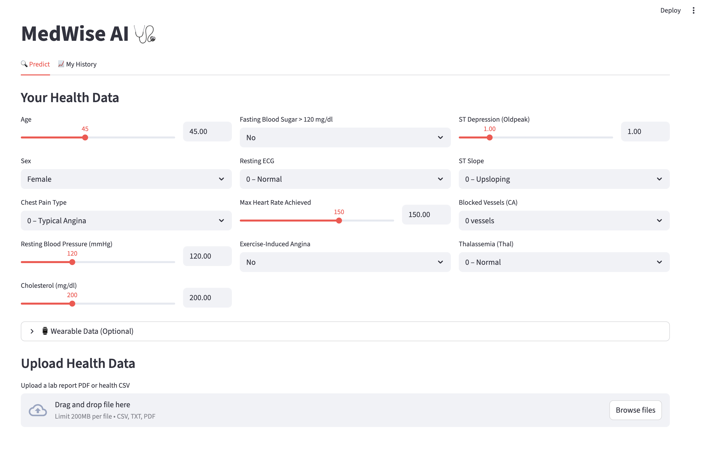
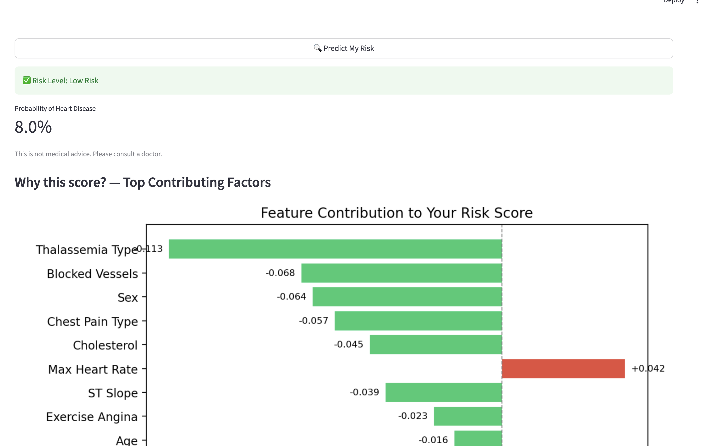
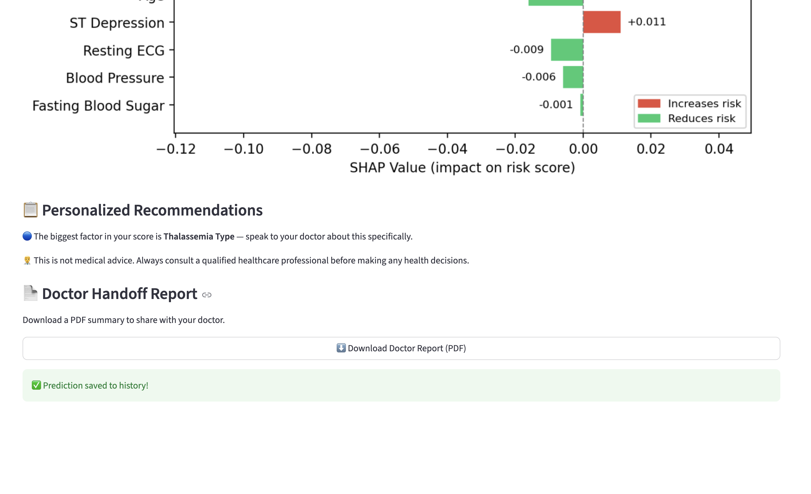

# MedWise AI 🩺
**Live Demo:** [medwise-ai.streamlit.app](https://medwise-ai.streamlit.app)

An AI-powered heart disease risk prediction app built with Python and Streamlit.

## Screenshots





---

## What It Does

- **Predicts heart disease risk** using a Random Forest model trained on clinical data
- **Explains the prediction** with a SHAP feature importance chart — shows exactly which health factors drove your score
- **Parses lab report PDFs** and extracts structured values (LDL, HDL, HbA1c, glucose, etc.) with clinical reference ranges
- **Tracks your history** with a personal timeline of past predictions
- **Generates a doctor handoff PDF** — a one-page report you can bring to your physician

---

## Setup

### 1. Clone the repo
```bash
git clone https://github.com/kranthim-code/medwise-ai.git
cd medwise-ai
```

### 2. Install dependencies
```bash
pip install -r requirements.txt
```

### 3. Train the model
```bash
python3 model.py
```

### 4. Run the app
```bash
streamlit run app.py
```

The app will open at `http://localhost:8501`

---

## Project Structure

```
medwise-ai/
├── app.py                  # Streamlit frontend
├── model.py                # Model training script
├── predict.py              # Prediction + SHAP explainability
├── lab_parser.py           # PDF lab report parser
├── report_generator.py     # Doctor handoff PDF builder
├── heart.csv               # Training dataset
├── model.pkl               # Trained model (generated by model.py)
├── prediction_history.csv  # Auto-generated prediction log
└── requirements.txt        # Dependencies
```

---

## Features by Phase

**Phase 1 — Smarter Personalization**
- SHAP explainability chart after every prediction
- Wearable data inputs (resting HR, sleep, daily steps)
- Prediction history tab with timeline chart

**Phase 2 — Lab Report Analysis**
- Upload a lab PDF and get a structured table of extracted values
- 17 lab tests supported with clinical reference ranges
- Color-coded normal/abnormal flags

**Phase 3 — Doctor Handoff**
- Personalized health recommendations based on your risk profile
- Downloadable PDF report with risk score, top factors, lab results, and recommendations

---

## Notes

- This app is for informational purposes only and does not constitute medical advice
- Always consult a qualified healthcare professional before making health decisions
- An OpenAI API key is optional — recommendations work without one

## Contributors
- [Kranthi Muthavarapu](https://github.com/kranthim-code)
- [Akash Inumella](https://github.com/akashinumella)
